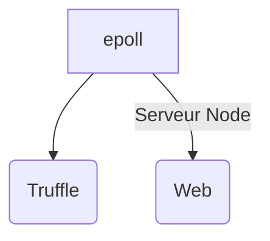

# Start Project
**[Linux]**  
CMD 1 : Ganache-cli -a 40 -l 0x1C9C380  
CMD 2 : cd Truffle && truffle migrate --compile-all && cd ../Web && npm install && npm start
  
**[Windows]**  
CMD 1 : Ganache-cli -a 40 -l 0x1C9C380  
CMD 2 : cd Truffle   
CMD 3 : truffle migrate --compile-all  
CMD 4 : cd ../Web  
CMD 5 : npm install  
CMD 6 : npm start  

# epoll
Projet BlockChain
Serveur Ganache sur le port 8545
Serveur NodeJs sur le port 8546

## Required installation
Node -v >= 7
npm install –g truffle
npm install –g ganache-cli
cd Web && npm install

## Truffle infos & command
Compile:        truffle compile
Migrate:        truffle migrate
Test contracts: truffle test

## Ganache Infos & command
Lunch : ganache-cli -a 40 -l 0x1C9C380
  -a : nombre d’account
  -l : gas limit

## nodeJs Infos & command
cd web
npm install (nistall depedencies)
npm start (run server)

## Project diagrams

Vote déb : 01/03/18
Vote fin : 30/03/18
